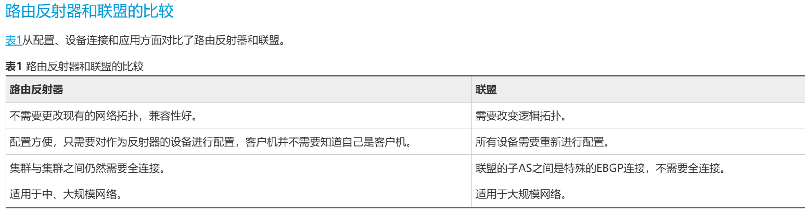
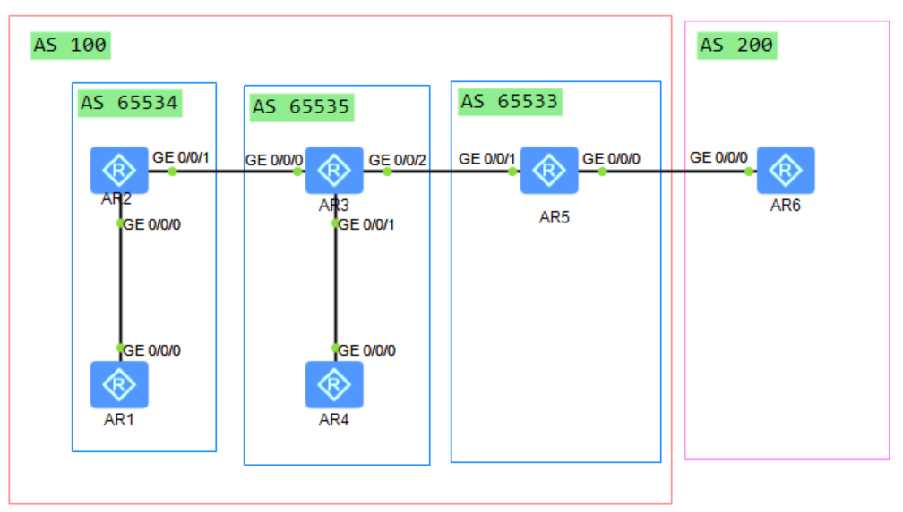

### BGP 联盟（BGP Confederation）

BGP 联盟（也叫 BGP 联邦）是与路由反射器 RR 并列的、解决 IBGP 全互联扩展性瓶颈的两大标准方案，由 IETF RFC 5065 标准定义（替代原 RFC 3065）。其核心思想是将一个庞大的公有 AS 拆分为多个私有的子自治系统（Sub-AS/Member AS），对外呈现为一个单一的完整 AS，对内通过特殊的联盟 EBGP 机制解除 IBGP 全互联约束，同时保留 IBGP 核心路由属性的端到端传递。

|AS 号类型|定义与使用规则|
|---|---|
|联盟 ID（公有 AS 号）|整个联盟对外的唯一身份标识，使用公网合法 AS 号，外部 AS 仅能看到该 AS 号，完全感知不到内部子 AS 结构|
|子 AS 号（私有 AS 号）|联盟内部划分的小 AS 编号，仅在联盟内部有效，推荐使用私有 AS 段（2 字节：64512~65534；4 字节：4200000000~4294967294），对外完全隐藏|

### 三种核心对等体类型

联盟定义了三类 BGP 对等体，行为规则差异极大，是理解联盟的核心：

1. **联盟内 IBGP 对等体**
    
    同一个子 AS 内的 BGP 对等体，完全遵循标准 IBGP 规则：子 AS 内仍需满足 IBGP 水平分割要求，可选择 IBGP 全互联，也可在子 AS 内部署 RR 进一步优化扩展性，与普通 AS 内的 IBGP 配置无差异。
    
2. **联盟内 EBGP 对等体（Confederation EBGP）**
    
    不同子 AS 之间的 BGP 对等体，是联盟的核心创新点，行为介于普通 EBGP 和 IBGP 之间：
    
    - 继承 EBGP 的防环能力：路由跨子 AS 传递时，通过 AS_PATH 的联盟专属字段实现防环，无需全互联；
    - 保留 IBGP 的属性传递：路由传递时不会重置 NEXT_HOP、LOCAL_PREF、MED 等核心 IBGP 属性，保证 AS 内选路策略的端到端一致性。
    
3. **普通 EBGP 对等体**
    
    联盟边界设备与联盟外部 AS 建立的 BGP 对等体，完全遵循标准 EBGP 规则。路由发布到联盟外部时，会自动剥离所有内部子 AS 信息，仅保留联盟 ID，外部 AS 将整个联盟视为一个单一的标准 AS。

联盟内的路由传递：  
从联盟AS-EBGP邻居学习到的路由，传递给联盟AS内的IBGP邻居 或 联盟AS间的EBGP邻居 都需要修改下一跳使得路由可达
==对于所有发出联盟AS的路由 都会清空携带的联盟子AS编号==

