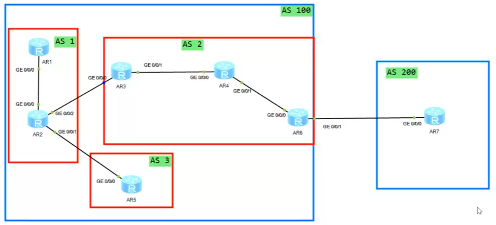

  ==联邦（Confederation）==


AS 100    联盟AS  
AS1、AS2  联盟子AS


```
联盟的邻居建立：  
[AR1]bgp 1     
[AR1-bgp]confederation id 100   # 指定联盟AS的ID  
[AR1-bgp]peer 2.2.2.2 as-number 1   # 建立联盟子AS内的IBGP邻居  
[AR1-bgp]peer 2.2.2.2 con LoopBack 0   
[AR2-bgp]peer 3.3.3.3 as-number 2   # 建立联盟子AS间的EBGP邻居  
[AR2-bgp]peer 3.3.3.3 connect-interface LoopBack 0  
[AR2-bgp]peer 3.3.3.3 ebgp-max-hop 10 
```
 
对于建立的EBGP邻居，默认情况下设备会使用联盟AS号访问对方  
对于建立联盟子AS的EBGP邻居，需要事先指定联盟子AS的邻居AS号  
```
[AR2-bgp]confederation peer-as 2    指定AS 2 为联盟子AS号
```

联盟内的路由传递：  
从联盟AS-EBGP邻居学习到的路由，传递给联盟AS内的IBGP邻居 或 联盟AS间的EBGP邻居 都需要修改下一跳使得路由可达
==对于所有发出联盟AS的路由 都会清空携带的联盟子AS编号==


# BGP 联盟（BGP Confederation）全解析

BGP 联盟（也叫 BGP 联邦）是与路由反射器 RR 并列的、解决 IBGP 全互联扩展性瓶颈的两大标准方案，由 IETF **RFC 5065** 标准定义（替代原 RFC 3065）。其核心思想是**将一个庞大的公有 AS 拆分为多个私有的子自治系统（Sub-AS/Member AS），对外呈现为一个单一的完整 AS，对内通过特殊的联盟 EBGP 机制解除 IBGP 全互联约束**，同时保留 IBGP 核心路由属性的端到端传递。

---

## 一、前置背景：联盟解决的核心问题

IBGP 默认的水平分割规则要求：从一个 IBGP 对等体学到的路由，不能传递给另一个 IBGP 对等体。这就要求 AS 内所有 BGP 设备必须全互联，n 台设备需要建立 `n(n-1)/2` 个 IBGP 邻居。

当 AS 内设备规模扩大到数十台、上百台时，邻居数量会指数级增长，带来极高的设备 CPU / 内存开销、运维复杂度和故障风险。

RR 通过角色划分打破水平分割，而联盟则通过 “AS 分治” 的思路从架构上彻底解决该问题，更适配超大规模网络场景。

### 联盟的 AS 号规划规则

表格

|AS 号类型|定义与使用规则|
|---|---|
|联盟 ID（公有 AS 号）|整个联盟对外的唯一身份标识，使用公网合法 AS 号，外部 AS 仅能看到该 AS 号，完全感知不到内部子 AS 结构|
|子 AS 号（私有 AS 号）|联盟内部划分的小 AS 编号，仅在联盟内部有效，推荐使用私有 AS 段（2 字节：64512~65534；4 字节：4200000000~4294967294），对外完全隐藏|

---

## 二、BGP 联盟的核心架构与对等体类型

### 整体组网架构


典型的联盟架构中，一个公有 AS（如 AS 100）被拆分为多个平行的子 AS（如 AS 65001、65002、65003），子 AS 内部运行 IBGP，子 AS 之间建立联盟 EBGP 邻居，联盟边界设备与外部 AS 建立普通 EBGP 邻居。

### 三种核心对等体类型

联盟定义了三类 BGP 对等体，行为规则差异极大，是理解联盟的核心：

1. **联盟内 IBGP 对等体**
    
    同一个子 AS 内的 BGP 对等体，完全遵循标准 IBGP 规则：子 AS 内仍需满足 IBGP 水平分割要求，可选择 IBGP 全互联，也可在子 AS 内部署 RR 进一步优化扩展性，与普通 AS 内的 IBGP 配置无差异。
    
2. **联盟内 EBGP 对等体（Confederation EBGP）**
    
    不同子 AS 之间的 BGP 对等体，是联盟的核心创新点，行为介于普通 EBGP 和 IBGP 之间：
    
    - 继承 EBGP 的防环能力：路由跨子 AS 传递时，通过 AS_PATH 的联盟专属字段实现防环，无需全互联；
    - 保留 IBGP 的属性传递：路由传递时不会重置 NEXT_HOP、LOCAL_PREF、MED 等核心 IBGP 属性，保证 AS 内选路策略的端到端一致性。
    
3. **普通 EBGP 对等体**
    
    联盟边界设备与联盟外部 AS 建立的 BGP 对等体，完全遵循标准 EBGP 规则。路由发布到联盟外部时，会自动剥离所有内部子 AS 信息，仅保留联盟 ID，外部 AS 将整个联盟视为一个单一的标准 AS。
    

---

## 三、BGP 联盟的核心工作机制

### 1. 核心基石：AS_PATH 的特殊处理

AS_PATH 是 BGP 的核心属性，联盟为其新增了 2 种专属类型，同时定义了严格的处理规则，是实现 “对内防环、对外隐藏” 的核心：

表格

|AS_PATH 类型|格式与作用|
|---|---|
|AS_Confed_Sequence|联盟内子 AS 号的有序列表，用小括号`()`包裹，仅在联盟内部有效。路由从一个子 AS 发给另一个子 AS 时，发送方会将本地子 AS 号追加到该列表最前端，用于联盟内防环|
|AS_Confed_Set|联盟内子 AS 号的无序集合，用大括号`{}`包裹，仅在联盟内路由聚合场景使用，无论包含多少子 AS 号，BGP 选路时 AS_PATH 长度按 1 计算|

#### 关键处理规则

- **对外隐藏规则**：路由发布到联盟外部时，设备会自动将 AS_PATH 中所有`AS_Confed_Sequence`和`AS_Confed_Set`完全剥离，仅将联盟 ID 添加到标准`AS_Sequence`最前端，外部 AS 完全看不到内部子 AS 结构。
- **选路规则**：BGP 优选 AS_PATH 最短的路由，但`AS_Confed_Sequence/Set`中的子 AS 号**不计入 AS_PATH 长度**，不会影响路由的选路优先级。

### 2. 联盟 EBGP vs 普通 EBGP 核心差异

这是联盟最容易混淆的知识点，二者核心行为对比如下：

表格

|对比维度|联盟 EBGP|普通 EBGP|
|---|---|---|
|NEXT_HOP 属性|不修改，保留原始下一跳地址（同 IBGP）|默认修改为自身出接口地址|
|LOCAL_PREF 属性|端到端保留传递|不传递，收到后重置为默认值 100|
|MED 属性|跨子 AS 保留传递|默认不会传递给其他 AS|
|AS_PATH 处理|子 AS 号添加到 AS_Confed_Sequence|本地 AS 号添加到 AS_Sequence|
|TTL 默认值|1（同普通 EBGP，非直连需修改 ebgp-max-hop）|1|
|管理距离（华为）|200（同 IBGP）|20|
|选路优先级|与 IBGP 路由同级，无优先|优先于 IBGP 路由|

### 3. 完整路由传递流程

以联盟 ID AS 100，拆分为 AS 65001、AS 65002 两个子 AS 为例，路由端到端传递流程如下：

1. **路由始发**：AS 65001 内的设备发布一条内网路由，通过 IBGP 传递给本 AS 的联盟边界设备。
2. **跨子 AS 传递**：AS 65001 的边界设备将路由通过联盟 EBGP 发给 AS 65002 的对等体，同时将本地子 AS 号`65001`追加到`AS_Confed_Sequence`中；路由的 NEXT_HOP、LOCAL_PREF、MED 等属性完全保留。
3. **子 AS 内扩散**：AS 65002 收到路由后，通过 IBGP（或 RR）反射给本 AS 内的所有设备，实现联盟内路由互通。
4. **对外发布**：联盟边界设备将路由发布给外部 AS 200 时，自动剥离`AS_Confed_Sequence`，将联盟 ID `100`添加到 AS_Sequence 最前端，外部 AS 200 看到的 AS_PATH 仅为`100`，完全感知不到内部子 AS 划分。
5. **外部路由接收**：从外部 AS 200 收到的路由，进入联盟后，在子 AS 之间传递时保留所有 IBGP 属性，同时追加经过的子 AS 号到`AS_Confed_Sequence`，最终扩散到全联盟。

---

## 四、BGP 联盟的防环机制

联盟构建了三层完整的防环体系，彻底避免路由环路：

1. **子 AS 之间的防环**：设备收到联盟 EBGP 路由时，会检查`AS_Confed_Sequence`，如果列表中包含本地子 AS 号，直接丢弃该路由，与普通 EBGP 的 AS_PATH 防环逻辑完全一致。
2. **子 AS 内部的防环**：完全遵循标准 IBGP 水平分割规则；如果子 AS 内部署了 RR，同时通过`Originator_ID`和`Cluster_List`属性实现 RR 场景的双重防环。
3. **联盟与外部 AS 的防环**：遵循标准 BGP AS_PATH 防环规则，外部 AS 收到路由时，若 AS_PATH 中包含自身 AS 号则直接丢弃；联盟接收外部路由时执行相同检查。

---

## 五、BGP 联盟的典型部署模式

### 1. 基础单级联盟（入门级）

- **架构**：一个联盟 ID，拆分为多个平行的子 AS，子 AS 边界设备之间全互联建立联盟 EBGP 对等体，子 AS 内部采用 IBGP 全互联。
- **适用场景**：中大型 AS，设备数量数百台，按地域、业务部门划分独立管理域，需要简化 IBGP 全互联的同时实现管理隔离。
- **优缺点**：配置简单，逻辑清晰；但子 AS 内设备数量过多时，仍会面临 IBGP 全互联的扩展性问题。

### 2. 联盟 + RR 组合部署（生产主流）

- **架构**：联盟拆分为多个子 AS，**每个子 AS 内部署双备份 RR**，彻底解决子 AS 内 IBGP 全互联问题；子 AS 之间仅需在 RR 之间建立联盟 EBGP 对等体，无需所有边界设备全互联。
- **核心优势**：结合了联盟的纵向分治能力和 RR 的横向扩展能力，可适配超大规模 AS（数千台设备），是运营商骨干网、跨国企业广域网的标准部署方案。
- **适用场景**：运营商全国骨干网、大型跨国企业广域网，需要兼顾极致扩展性、管理隔离和高可靠性。

### 3. 分级联盟（极少用）

- **架构**：子 AS 内再嵌套下一级子联盟，形成多层级树形联盟结构。
- **现状**：配置和运维复杂度极高，路由收敛慢，现网几乎不使用，不推荐部署。

---

## 六、BGP 联盟 vs 路由反射器 RR 全面对比

表格

|对比维度|BGP 联盟|路由反射器 RR|
|---|---|---|
|核心思想|将一个大 AS 拆分为多个子 AS，通过类 EBGP 机制解除全互联约束|在同一个 AS 内通过角色划分（RR / 客户端）打破 IBGP 水平分割|
|AS 号规划|需要全局规划联盟 ID 和多个子 AS 号|无需修改 AS 号，仅需在 RR 上配置客户端关系|
|配置复杂度|高，需要整网同步修改配置，割接难度大|低，可单侧配置，增量部署，对现有网络改动极小|
|增量部署|不支持，必须整网完成规划和配置才能生效|完美支持，可逐步替换全互联网络，不影响业务|
|扩展性上限|极高，结合 RR 可支持数万级别的 BGP 设备|中高，分级 RR 可支持上千台设备，超大规模下存在性能瓶颈|
|路由策略管控|极强，子 AS 之间可独立部署精细化路由策略，管理边界清晰|中，可通过 RR 集群实现策略管控，但跨集群策略配置复杂度高|
|拓扑隐藏|对外完全隐藏内部子 AS 结构和网络拓扑|对外隐藏 AS 内部拓扑，外部 AS 无感知|
|现网使用率|较低，仅超大型网络使用|极高，是解决 IBGP 全互联的主流方案|
|故障排障难度|较高，路由传递路径长，AS_PATH 包含联盟专属字段，定位复杂|较低，逻辑简单，路由传递路径清晰，排障门槛低|

---

## 七、生产部署关键注意事项

1. **子 AS 号规范**：必须使用私有 AS 号，避免与公网 AS 号冲突，防止对外发布路由时出现 AS_PATH 异常和环路。
2. **兼容性要求**：联盟内所有设备必须支持 RFC 5065 标准，确保联盟专属 AS_PATH 字段的正确识别和处理，避免路由黑洞。
3. **邻居建立优化**：联盟 EBGP 对等体推荐使用 Loopback 接口建立，需修改`ebgp-max-hop`（默认 TTL=1），同时通过 IGP 保证 Loopback 路由三层可达。
4. **属性保护**：绝对不要手动过滤`AS_Confed_Sequence/Set`属性，否则会直接导致联盟内路由环路。
5. **选路优化**：BGP 选路时，联盟 EBGP 路由与 IBGP 路由优先级相同，不会像普通 EBGP 那样优于 IBGP，需通过 LOCAL_PREF、MED 等属性手动优化路由路径。
6. **部署优先级**：绝大多数中小规模网络，优先使用 RR 即可满足需求；仅超大规模、多管理域的 AS，推荐使用 “联盟 + RR” 的组合方案。

---

## 八、华为设备基础配置示例（eNSP Pro 适配）

以联盟 ID AS 100，2 个子 AS 65001、65002 为例，核心配置如下（符合华为 VRP 系统规范，注释格式匹配毕业设计要求）：

### R1（子 AS 65001，联盟边界设备）

plaintext

```
# 配置全局BGP，指定子AS号和联盟ID
bgp 65001
 confederation id 100  # 配置联盟ID，整个联盟必须一致
 confederation peer-as 65002  # 指定联盟内对端子AS号
 peer 10.0.12.2 as-number 65002  # 与R2建立联盟EBGP对等体
 peer 192.168.1.2 as-number 65001  # 子AS内IBGP对等体
# 地址族配置
 ipv4-family unicast
  peer 10.0.12.2 enable  # 激活联盟EBGP对等体
  peer 192.168.1.2 enable  # 激活子AS内IBGP对等体
```

### R2（子 AS 65002，联盟边界设备）

plaintext

```
# 配置全局BGP，指定子AS号和联盟ID
bgp 65002
 confederation id 100  # 联盟ID与对端一致
 confederation peer-as 65001  # 指定联盟内对端子AS号
 peer 10.0.12.1 as-number 65001  # 与R1建立联盟EBGP对等体
 peer 192.168.2.2 as-number 65002  # 子AS内IBGP对等体
# 地址族配置
 ipv4-family unicast
  peer 10.0.12.1 enable  # 激活联盟EBGP对等体
  peer 192.168.2.2 enable  # 激活子AS内IBGP对等体
```

### 补充说明

- 联盟内所有设备的`confederation id`必须完全一致；
- 联盟 EBGP 对等体之间，必须通过`confederation peer-as`指定对端的子 AS 号，否则会被识别为普通 EBGP 邻居；
- 子 AS 内的 IBGP 配置、RR 配置，与普通 AS 内的配置完全一致，无需额外修改。