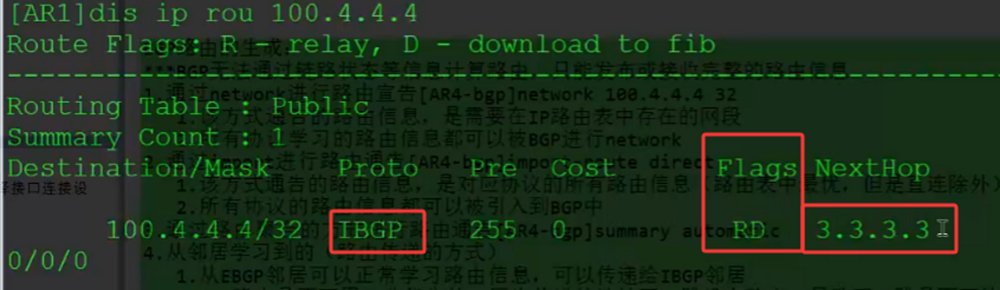

通过BGP学习到对端的路由信息，且路由信息是==最优的可用==的  
该路由信息就会加入到IP路由表中，且flag字段的Rbit置位表示递归路由

### 一、BGP路由的生成：
BGP无法通过链路状态等信息计算路由，只能发布或接收完整的路由信息  
#### 1.通过network进行路由宣告
```
[AR4-bgp]network 100.4.4.4 32  
```
   1.该方式通告的路由信息，是==需要在IP路由表中存在的网段== 
   2.所有协议学习的路由信息都可以被BGP进行network  
   
#### 2.通过import进行路由通告
```
[AR4-bgp]import-route direct | static | ospf 1 | isis 1 |  
```
   1.该方式通告的路由信息，是对应协议的所有路由信息（路由表中最优，但是直连除外）  
   2.所有协议的路由信息都可以被引入到BGP中  
   
#### 3.通过路由聚合的方式进行路由通告
```
[AR4-bgp]summary automatic
```   

#### 4.从邻居学习到的（路由传递的方式）（以ASBR为视角）  

  **1.从EBGP邻居可以正常学习路由信息，可以传递给IBGP邻居**
    路由是不可用、非优先的，因为传递的路由的下一跳没有改变，导致下一跳是不可达的  
    因为BGP的路由都是需要进行递归、迭代的，所以BGP的路由需要根据下一跳进行路由递归  
    对于BGP路由下一跳不可达：  
	    1.通过路由信息的学习，使得下一跳可达：配置静态路由（==不切实际==）  
	    2.下一跳转变为可达的地址 ：
        ```[AR3-bgp]peer 1.1.1.1 next-hop-local # 向IBGP邻居传递路由信息时，将路由的下一跳变为自身的更新源地```

==对于BGP路由的访问：需要通过指定源去访问==
```ping -a 1.1.1.1 2.2.2.2```
BGP的数据访问还是要通过物理链路访问的，所以要求经过的每一台设备都要存在BGP的路由信息，如果存在设备没有路由信息，则会形成BGP的路由黑洞
	如何解决BGP的路由黑洞：
	  1.从EBGP邻居学习到的路由，引入到IGP内
	  2.通过VPN隧道来实现
	  3.建立全互联的IBGP邻居 （IBGP邻居关系建立的数量 和 设备的数量 成正比）
	  4.通过建立RR反射器 （减少AS内IBGP邻居关系数量）
    
    
  **2.从EBGP邻居可以正常学习路由信息，可以传递给EBGP邻居**  
    路由是最优的、可用的，下一跳为邻居的更新源地址（建立邻居的地址）

   **3.从IBGP邻居可以正常学习路由信息，可以传递给EBGP邻居**  
    优化后的结果是：路由是最优的、可用的，下一跳为邻居的更新源地址（建立邻居的地址）
	没有优化之前，需要满足BGP与IGP同步，才可以实现路由信息传递给EBGP邻居  
	为了防止路由黑洞的出现  
	要求在将BGP路由信息传递给EBGP邻居时，需要满足在IGP也学习到对应的路由信息  
	保障AS内所有设备都是存在路由信息的（给到对端AS的路由条目，本端AS内所有的设备都存在路由信息）  
	优化的操作是将BGP与IGP同步的功能 默认关闭（无法手动开启）
	```undo  synchronization # 撤销同步```

   **4.从IBGP邻居可以正常学习路由信息，不可以传递给IBGP邻居**  
        为了路由信息在AS内传递 防止环路的（AS内水平分割）


通过BGP学习到对端的路由信息，且路由信息是最优的可用的
该路由信息就会加入到IP路由表中，且flag字段的R bit置位表示递归路由

```
[AR4]display bgp routing-table 
 BGP Local router ID is 10.4.4.4   
 Status codes: * - valid, \> - best, d - damped,  
               h - history,  i - internal, s - suppressed, S - Stale  
               Origin : i - IGP, e - EGP, ? - incomplete
 Total Number of Routes: 1  
      Network            NextHop        MED        LocPrf    PrefVal Path/Ogn
 *\>   100.4.4.4/32       0.0.0.0         0                     0      i  
 
*代表路由可用   \>代表路由最优
```

### **二、AS 内水平分割（IBGP Split Horizon）

AS 内水平分割是**IBGP（内部 BGP）协议的核心防环机制**，其核心规则可精准概括为：  
路由器从一个 IBGP 邻居学习到的路由信息，**不会再传递给其他 IBGP 邻居**
（仅针对 IBGP 来源的路由，EBGP 来源路由不受此限制）。

解决 IBGP 的环路风险
要理解该机制的必要性，需先明确 IBGP 的本质特性 ——**IBGP 邻居属于同一 AS（自治系统）**，而 BGP 协议判断路由环路的核心依据是「AS-Path 属性」（路由经过的 AS 号列表）。
- ==当路由在 AS 内通过 IBGP 传递时，==**AS-Path 不会添加本 AS 号**==（仅 EBGP 传递时会追加 AS 号）；==
- ==若没有水平分割机制，路由可能在 AS 内的 IBGP 邻居间循环传递（例如 R1→R2→R3→R1），且因 AS-Path 未包含本 AS 号，BGP 无法识别环路，导致路由振荡、网络资源耗尽。==


二、关键细节：IBGP 水平分割的适用范围
该机制并非 “一刀切”，需明确其适用边界，避免与 EBGP 水平分割混淆：

|   |   |   |
|---|---|---|
|**对比维度**|**IBGP 水平分割（AS 内水平分割）**|**EBGP 水平分割（AS 间水平分割）**|
|适用邻居类型|同一 AS 内的 IBGP 邻居|不同 AS 间的 EBGP 邻居|
|核心规则|从 IBGP 邻居学来的路由，不传给其他 IBGP 邻居|从 EBGP 邻居学来的路由，不传给其他 EBGP 邻居|
|防环逻辑依据|AS-Path 不追加本 AS 号，需阻断 AS 内循环|AS-Path 会追加本 AS 号，传递后会形成 AS-Path 环路（如[65001, 65000]再传回 65000）|
|例外情况|路由反射器（RR）、联邦（Confederation）可突破|无（EBGP 全连接场景下严格执行）|

