# **配置详解：**
1. 底层使用IGP互联互通（OSPF，ISIS）
2. 配置LDP协议，PE，P，ASBR之间都需要配置
3. PE与CE之间通过IGP或者EBGP传递路由
4. PE与ASBR之间建立MP-BGP邻居关系（VPNv4），无RR场景
5. ASBR创建VRF，配置RD，RT
6. 两个ASBR之间建立MP-BGP邻居关系（VPN-Instance），互联接口绑定VPN-Instance
## 拓扑：
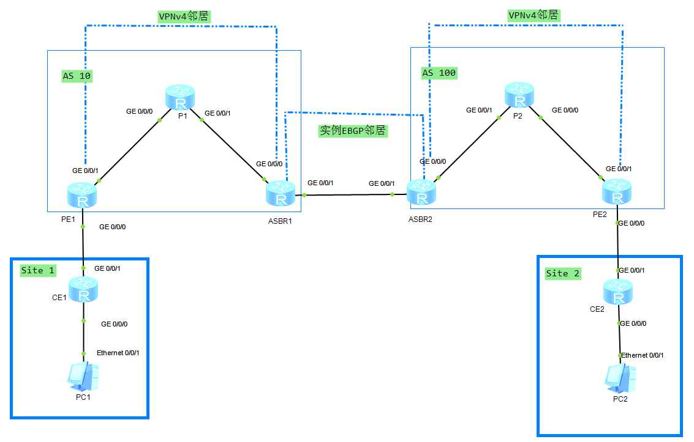
****
## 关键配置：
### ASBR1
```
ip vpn-instance B  
 ipv4-family  
  route-distinguisher 100:2  
  vpn-target 1:1 export-extcommunity  
  vpn-target 1:1 import-extcommunity  
#  
interface GigabitEthernet0/0/1  
 ip binding vpn-instance B
 ip address 10.0.45.4 255.255.255.0
#  
bgp 10  
 peer 2.2.2.2 as-number 10   
 peer 2.2.2.2 connect-interface LoopBack0  
 #  
 ipv4-family unicast  
  undo peer 2.2.2.2 enable  
 #   
 ipv4-family vpnv4  
  policy vpn-target  
  peer 2.2.2.2 enable  
 #  
 ipv4-family vpn-instance B   
  peer 10.0.45.5 as-number 100   
#
```
### ASBR2：
```
ip vpn-instance D  
 ipv4-family  
  route-distinguisher 200:2  
  vpn-target 1:1 export-extcommunity  
  vpn-target 1:1 import-extcommunity  
#  
interface GigabitEthernet0/0/1  
 ip binding vpn-instance D  
 ip address 10.0.45.5 255.255.255.0  
#  
bgp 100  
 peer 7.7.7.7 as-number 100   
 peer 7.7.7.7 connect-interface LoopBack0  
 #  
 ipv4-family unicast  
  undo peer 7.7.7.7 enable  
 #   
 ipv4-family vpnv4  
  policy vpn-target  
  peer 7.7.7.7 enable  
 #  
 ipv4-family vpn-instance D   
  peer 10.0.45.4 as-number 10   
#
```


## **控制平面：**
如何从PC1去访问PC2：
1.CE2与PE2之间建立OSPF邻居关系，通过G0/0/0绑定的VPN-Instance-C学习到192.168.2.1/24 路由条目，  
2.为了让Site 1 学习到192.168.2.0/24  
	PE2在BGP，VPN-Instance C 下 通告192.168.2.1/24这条路由，  
	由于是实例路由，携带RD=200:1 RT=1:1，PE2为它分配了一个1026的私网标签然后将路由信息通过MPLS 通告给MPLS LDP 邻居5.5.5.5（ASBR2），ASBR2得知，想要访问192.168.2.0/24 需要封装私网标签1026  
3.ASBR2通过VRF(VPN-Instance)将192.168.2.0/24的路由条目通告给ASBR1(传递的是普通IPv4路由)  
4.ASBR1通告G0/0/1下的VPN-Instance B得到192.168.2.0/24 所以会在通告给VPNv4的邻居时打上私网标签1028，通告给2.2.2.2PE1，想要访问192.168.2.0/24 需要封装1028这个私网标签
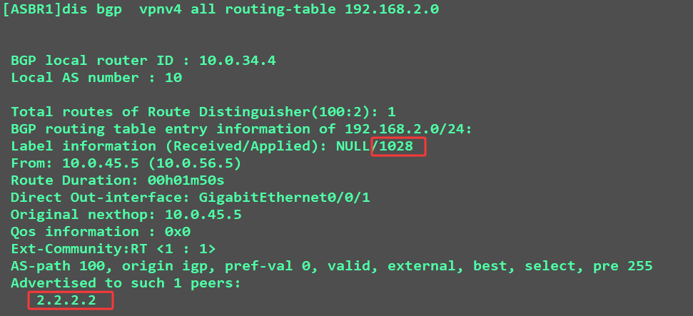
5.PE1得到192.168.2.0/24 这个路由后，通告在实例OSPF 2 下引入BGP，让OSPF 邻居CE1 学习到192.168.2.0/24.
**这样就是控制平面，如何单向想学习到该路由，想要数据通信，还要让CE2学习192.168.1.0/24**

## 转发（数据）平面：  
1.在PC1上ping 192.168.2.1  
到达网关：CE1  
2.CE1查路由表：存在该路由，下一跳为10.0.12.2
[CE1]dis ip routing-table 192.168.2.1
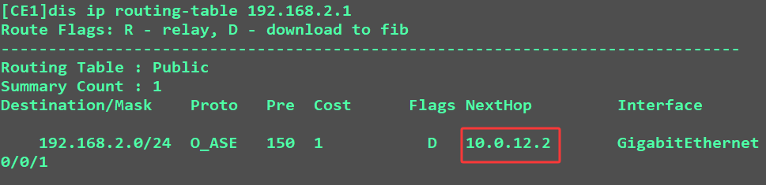
3.数据包到达PE1，PE1查vpn-instance表：该路由需要迭代到下一跳，4.4.4.4  
[PE1]dis ip routing-table vpn-instance A 192.168.2.1
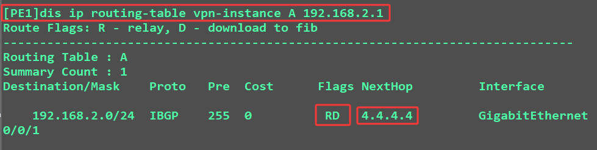

4.查看fib表项该路由是否进行mpls标签封装，通道ID非0，需要进行隧道封装
[PE1]display fib 4.4.4.4
  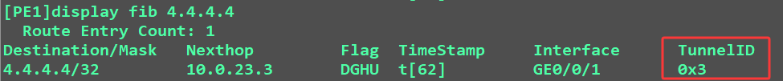

5.查看封装什么私网标签：私网标签为：1026
[PE1]display bgp vpnv4 all routing-table 192.168.2.1
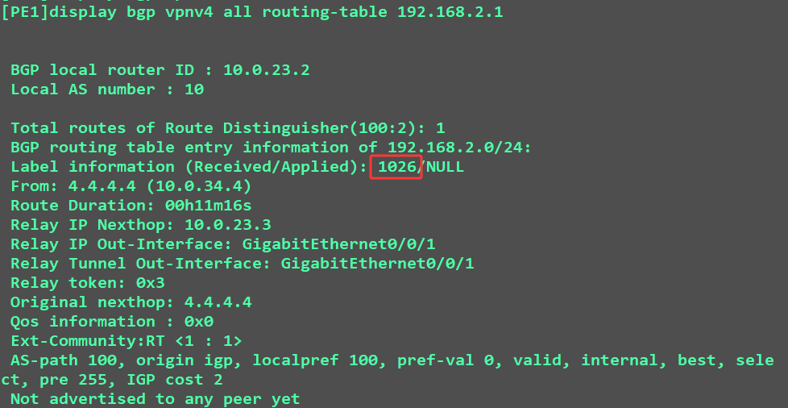
  
6.查看需要封装什么公网标签? 公网标签为：1025  
[PE1]display mpls lsp
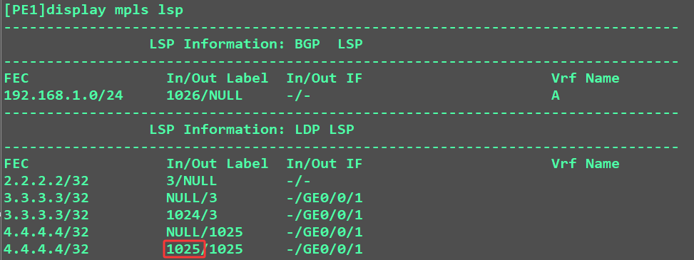  
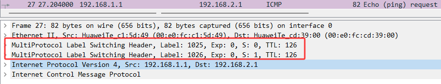  

7.到达ASBR1时，最后一条弹出公网标签，携带私网标签
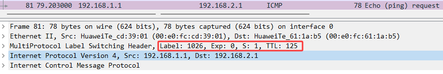  

8.ASBR1得到数据包后，之间与ASBR2进行IPv4数据交换。
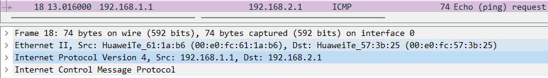  

9.数据包到达ASBR2后，ASBR2查看VPNv4路由表：从7.7.7.7收到1026的私网标签，封装  
[ASBR2]display bgp vpnv4 all routing-table 192.168.2.1
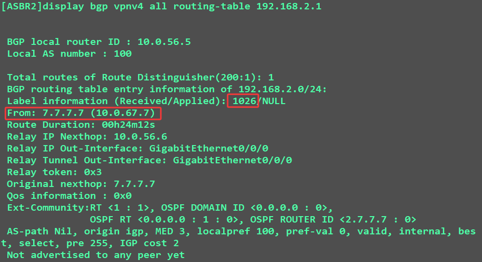  

10.去7.7.7.7如何走是否需要走通道？TunnelID 非0 需要进行通道封装  
[ASBR2]display fib
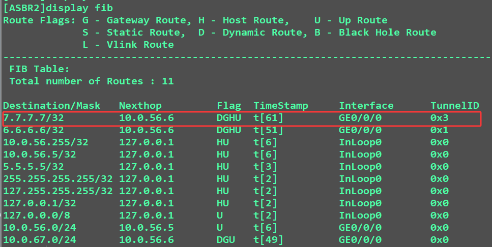  

11.去7.7.7.7封装什么公网标签：？1025
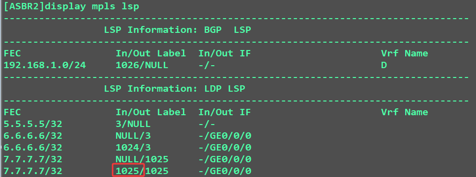  
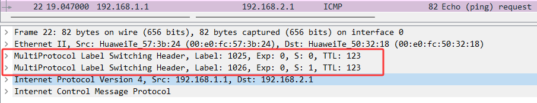
12.数据包到达PE2时 ，自动出栈公网标签，只携带私网标签
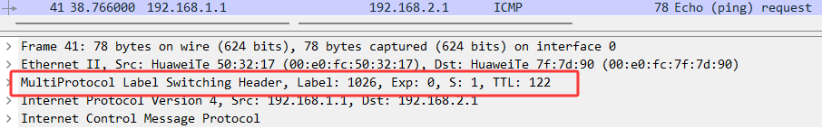
查看VPNv4路由，找到起源下一跳。走vpn-instance C
[PE2]display bgp vpnv4 all routing-table 192.168.2.1
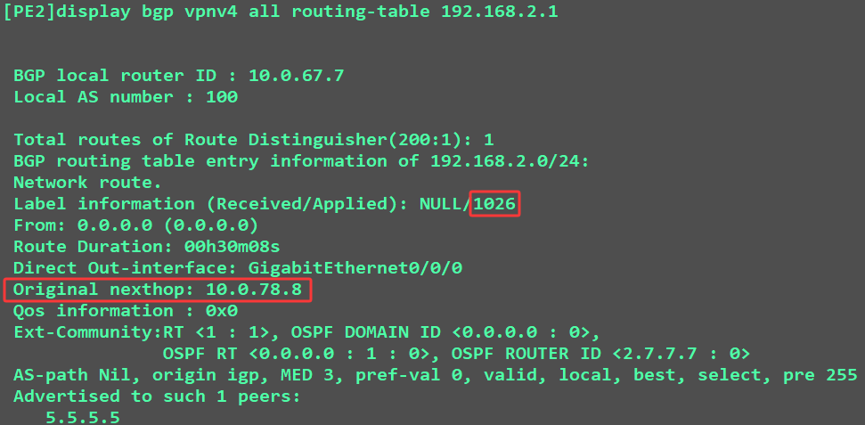
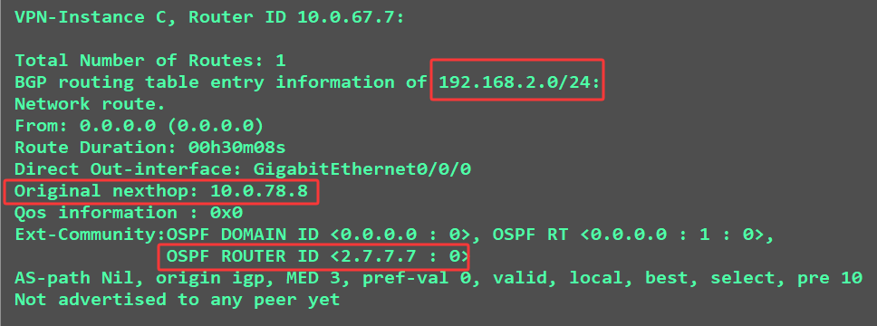
  
13.查看vpn-instance C的路由表：下一跳为CE2
[PE2]display ip routing-table vpn-instance C 192.168.2.1
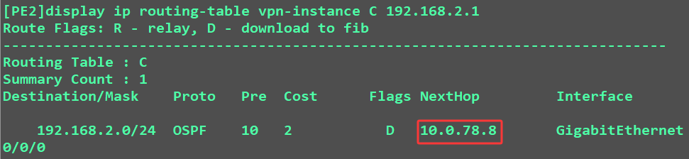  

14.在CE2上查看路由表：找到默认网关，
[CE2]dis ip routing-table 192.168.2.1
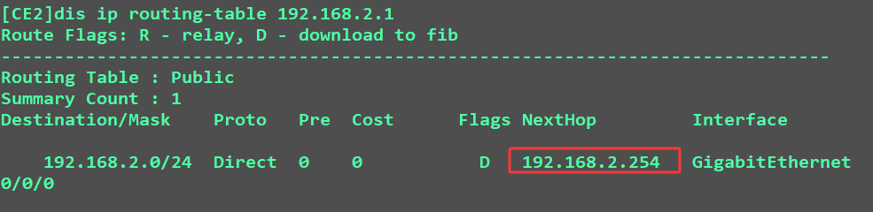


## 问题汇总：

### ASBR之间是BGP LSP
```
<ASBR1>DIS MPLS LSP
-------------------------------------------------------------------------------
                 LSP Information: BGP  LSP
-------------------------------------------------------------------------------
FEC                In/Out Label  In/Out IF                      Vrf Name       
192.168.2.0/24     1026/NULL     -/-                            B              
-------------------------------------------------------------------------------
                 LSP Information: LDP LSP
-------------------------------------------------------------------------------
FEC                In/Out Label  In/Out IF                      Vrf Name       
4.4.4.4/32         3/NULL        -/-                                           
3.3.3.3/32         NULL/3        -/GE0/0/0                                     
3.3.3.3/32         1024/3        -/GE0/0/0                                     
2.2.2.2/32         NULL/1025     -/GE0/0/0                                     
2.2.2.2/32         1025/1025     -/GE0/0/0 
```


查看ASBR1从本端PE学习到的 192.168.1.0/24的路由
```
[ASBR1]dis bgp vpnv4 all routing-table 192.168.1.0


 BGP local router ID : 10.0.34.4
 Local AS number : 10

 Total routes of Route Distinguisher(100:1): 1
 BGP routing table entry information of 192.168.1.0/24:
 Label information (Received/Applied): 1026/NULL
 From: 2.2.2.2 (10.0.23.2)
 Route Duration: 01h47m46s  
 Relay IP Nexthop: 10.0.34.3
 Relay IP Out-Interface: GigabitEthernet0/0/0
 Relay Tunnel Out-Interface: GigabitEthernet0/0/0
 Relay token: 0x3
 Original nexthop: 2.2.2.2
 Qos information : 0x0
 Ext-Community:RT <1 : 1>, OSPF DOMAIN ID <0.0.0.0 : 0>, 
               OSPF RT <0.0.0.0 : 1 : 0>, OSPF ROUTER ID <2.2.2.2 : 0>
 AS-path Nil, origin igp, MED 3, localpref 100, pref-val 0, valid, internal, best, select, pre 255, IGP cost 2
 Not advertised to any peer yet


 VPN-Instance B, Router ID 10.0.34.4:

 Total Number of Routes: 1
 BGP routing table entry information of 192.168.1.0/24:
 Label information (Received/Applied): 1026/NULL
 From: 2.2.2.2 (10.0.23.2)
 Route Duration: 01h47m46s  
 Relay Tunnel Out-Interface: GigabitEthernet0/0/0
 Relay token: 0x3
 Original nexthop: 2.2.2.2
 Qos information : 0x0
 Ext-Community:RT <1 : 1>, OSPF DOMAIN ID <0.0.0.0 : 0>, 
               OSPF RT <0.0.0.0 : 1 : 0>, OSPF ROUTER ID <2.2.2.2 : 0>
 AS-path Nil, origin igp, MED 3, localpref 100, pref-val 0, valid, internal, best, select, active, pre 255, IGP cost 2
 Advertised to such 1 peers:
    10.0.45.5
```

查看ASBR1从对端ASBR2学习到的路由
```
[ASBR1]dis bgp vpnv4 all routing-table 192.168.2.0


 BGP local router ID : 10.0.34.4
 Local AS number : 10

 Total routes of Route Distinguisher(100:2): 1
 BGP routing table entry information of 192.168.2.0/24:
 Label information (Received/Applied): NULL/1026
 From: 10.0.45.5 (10.0.56.5)
 Route Duration: 01h48m13s  
 Direct Out-interface: GigabitEthernet0/0/1
 Original nexthop: 10.0.45.5
 Qos information : 0x0
 Ext-Community:RT <1 : 1>
 AS-path 100, origin igp, pref-val 0, valid, external, best, select, pre 255
 Advertised to such 1 peers:
    2.2.2.2

 VPN-Instance B, Router ID 10.0.34.4:

 Total Number of Routes: 1
 BGP routing table entry information of 192.168.2.0/24:
 From: 10.0.45.5 (10.0.56.5)
 Route Duration: 01h48m13s  
 Direct Out-interface: GigabitEthernet0/0/1
 Original nexthop: 10.0.45.5
 Qos information : 0x0
 AS-path 100, origin igp, pref-val 0, valid, external, best, select, active, pre 255
 Not advertised to any peer yet
```

会发现：
- 192.168.1.0/24：从**本 AS 内部 PE**学来，需以**普通 IPv4 路由**形式通告给**对端 ASBR**；
- 192.168.2.0/24：从**对端 ASBR**学来，需以**VPNv4 路由**形式通告给**本 AS 内部 PE**。


