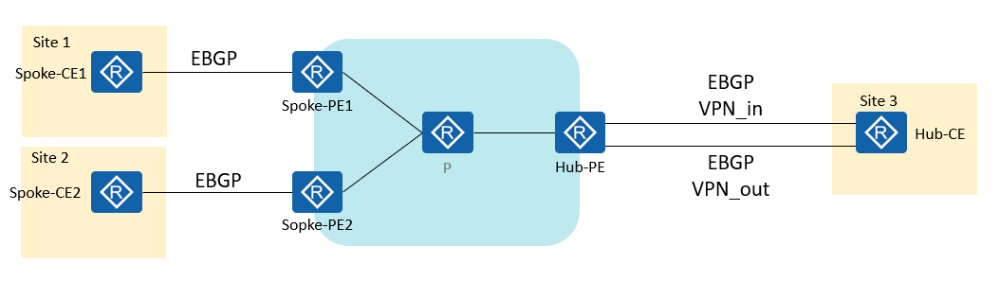
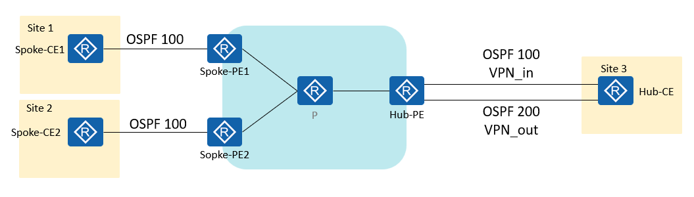
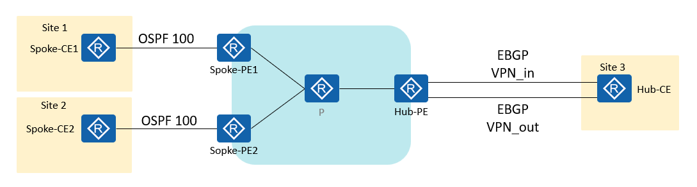
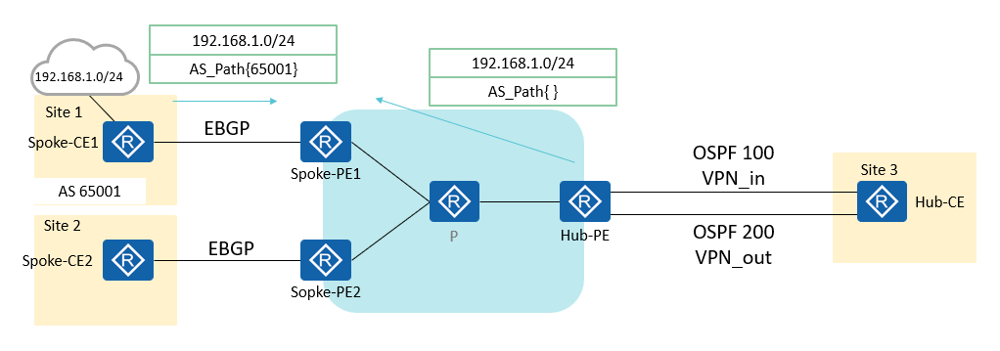

# Hub&Spoke模型路由发布的三种方式
HUB-Spoken 的几种路由发布模型：
## 1.站点和Hub都是BGP
  
## 2.站点和Hub都是OSPF

### 与建立EBGP相比，OSPF 100 与OSPF 200的执行动作不同，
1. OSPF 100 负责将Site1 和 Site 2 学习，并再OSPF 100中引入BGP路由，传递给Hub-CE，
2. Hub-CE只需要一个OSPF进程；OSPF 200从Hub-CE的OSPF进程学习到 Hub-CE从OSPF 100学习到的路由
	（默认是学习不到的，应为OSPF从BGP引入的路由DN bit会置位），
3. 所以需要在OSPF 200进程下取消对DN bit置位的检查。
```R
ospf 200 router-id 6.6.6.20 vpn-instance out
 dn-bit-check disable summary # 从Hub-CE学习来的路由是3类LSA
```
4. 在BGP ipv4-family vpn-instance out 地址族下，引入OSPF 200的路由，将路由发送出去。

## 3.站点OSPF，Hub-BGP

## 存在问题的第四种方式：
==IGP再引入BGP路由时，会忽略AS_Path。==

以从Spoke-CE1向Spoke-CE2发布路由（目的地址为192.168.1.0/24）为例，大体过程如下：
- Spoke-CE1通过EBGP将路由发布给Spoke-PE1。
- Spoke-PE1通过IBGP将路由发布给Hub-PE。
- Hub-PE通过BGP-VPN实例（VPN_in）的Import Target属性将该路由引入VPN_in路由表；并通过OSPF100多实例发布给Hub-CE。
- Hub-CE通过OSPF100学习到该路由；并通过OSPF200将路由发布给Hub-PE。
- Hub-PE的BGP-VPN实例（VPN_out）引入OSPF200多实例路由，并将携带VPN_out的Export Target属性的路由发布给所有Spoke-PE。
- Spoke-PE2的VPN实例根据Import Target属性引入该路由；Spoke-PE2通过EBGP发布给本地Spoke-CE2。

Hub-PE的BGP-VPN实例（VPN_out）通过Export Target属性将路由发布给Spoke-PE2的同时，也会将该路由发布给Spoke-PE1。此时，这条路由是Hub-PE通过IGP（OSPF200多实例）引入的，==由于IGP路由不携带AS-PATH属性，AS_Path为空；而原来从Spoke-CE1来的192.168.1.0/24路由，其AS_Path不为空，所以从Hub-PE返回的路由会优于从Spoke-CE1来的路由。== ==这样会引起路由振荡==，其过程如下：
- Spoke-CE1发来的路由因为AS_Path变成非最佳路由。
- Spoke-PE1发布Update撤销路由的报文给Hub-PE来撤销192.168.1.0/24路由。
- Hub-PE（通过撤销相应的OSPF LSA）撤销发给Hub-CE的路由。
- Hub-CE（原理同上）撤销发给Hub-PE的路由。
- Hub-PE发布Update撤销路由撤销发给Spoke-PE1的路由。
于是在Spoke-PE1上从Spoke-CE1来的路由又变成最佳路由。
Spoke-PE1又通过IBGP将路由发布给Hub-PE。
Hub-PE又会返回该路由，从Spoke-CE1来的路由又变成非最佳路由。
如此反复。