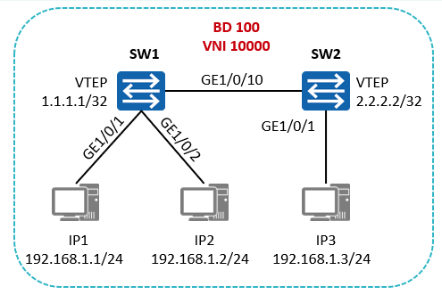
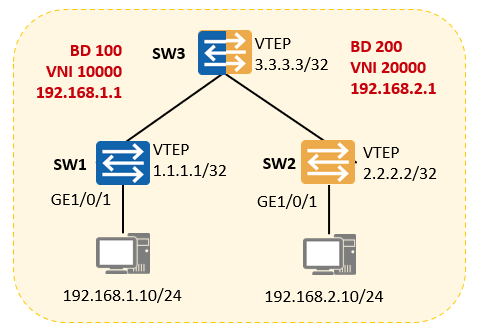

基本是：underlay需要配置完毕创建广播域BD。
[华为]桥域 bd-id
系统视图下创建广播域BD，进入BD视图。ID取值范围为1～16777215。


[Huawei-bd100] vxlan vni vni-id
BD视图下创建VXLAN网络标识VNI并关联广播域BD。ID取值范围为1～16777215 。

创建NVE接口。
[华为]接口nve nve-number
创建NVE接口，并进入NVE接口视图。一般情况下NVE接口编号有且1。

配置源VTEP的IP地址。
[Huawei-Nve1]源 ip-address
配置源端VTEP的IP地址。推荐使用Loopback接口的地址。

配置头端复制列表。
[Huawei-Nve1] vni vni-id head-end peer-list ip-address NVE视图下配置VNI指定多个 终端 VTEP的IP地址建立头端复制列表。本端NVE将根据此列表复制并转发报文。


[Huawei-GE1/0/1.1] encapsulation { dot1q [ vid low-vid [ to high-vid ] ] | 配置业务接入（子接口接入方式）。默认|取消标记| qinq [ vid id ]} 二层子接口视图下配置流封装类型，实现不同的二层子接口接入不同的数据报文。

配置业务接入点（VLAN接入方式）。
[Huawei-bd100] l2绑定vlan vlan-id
BD视图下配置。全局VLAN绑定到广播域BD前，请确保全局VLAN已经创建且相关接口已加入该VLAN。

配置三层网关。
【华为】接口vbdif bd-id
系统视图下VBDIF接口，并进入VBDIF接口视图后续配置网关IP地址。

	## 配置案例：同子网互访

```
配置VXLAN隧道
[SW1] bridge-domain 100  
[SW1-bd100] vxlan vni 10000

[SW1] interface Nve 1  
[SW1-Nve1] source 1.1.1.1  
[SW1-Nve1] vni 10000 head-end peer-list 2.2.2.2
```
```
配置业务接入  
[SW1] interface GigabitEthernet 1/0/1.1 mode l2  
[SW1-GigabitEthernet1/0/1.1] encapsulation untag  
[SW1-GigabitEthernet1/0/1.1] bridge-domain 100  
[SW1] interface GigabitEthernet 1/0/2.1 mode l2  
[SW1-GigabitEthernet1/0/2.1] encapsulation untag  
[SW1-GigabitEthernet1/0/2.1] bridge-domain 100

[SW2] bridge-domain 100  
[SW2-bd100] vxlan vni 10000

[SW2] interface Nve 1  
[SW2-Nve1] source 2.2.2.2  
[SW2-Nve1] vni 10000 head-end peer-list 1.1.1.1

[SW2] bridge-domain 100
[SW2-bd100] l2 binding vlan 1
```
 
配置案例：不同子网互访 (集中式网关)


```
配置VXLAN隧道
[SW1] bridge-domain 100  
[SW1-bd100] vxlan vni 10000

[SW1] interface Nve 1  
[SW1-Nve1] source 1.1.1.1  
[SW1-Nve1] vni 10000 head-end peer-list 3.3.3.3

配置业务接入  
[SW1] interface GigabitEthernet 1/0/1.1 mode l2  
[SW1-GigabitEthernet1/0/1.1] encapsulation untag  
[SW1-GigabitEthernet1/0/1.1] bridge-domain 100

配置VXLAN隧道  
[SW2] bridge-domain 200  
[SW2-bd100] vxlan vni 20000

[SW2] interface Nve 1  
[SW2-Nve1] source 2.2.2.2  
[SW2-Nve1] vni 20000 head-end peer-list 3.3.3.3

配置业务接入  
[SW2] interface GigabitEthernet 1/0/1.1 mode l2  
[SW2-GigabitEthernet1/0/1.1] encapsulation untag  
[SW2-GigabitEthernet1/0/1.1] bridge-domain 200
```
 
```
[SW3] bridge-domain 100  
[SW3-bd100] vxlan vni 10000

[SW3] bridge-domain 200  
[SW3-bd200] vxlan vni 20000

[SW3] interface Nve 1  
[SW3-Nve1] source 3.3.3.3  
[SW3-Nve1] vni 10000 head-end peer-list 1.1.1.1  
[SW3-Nve1] vni 20000 head-end peer-list 2.2.2.2

[SW3] interface Vbdif100  
[SW3-Vbdif100] ip address 192.168.1.1 24

[SW3] interface Vbdif200  
[SW3-Vbdif200] ip address 192.168.2.1 24
```
