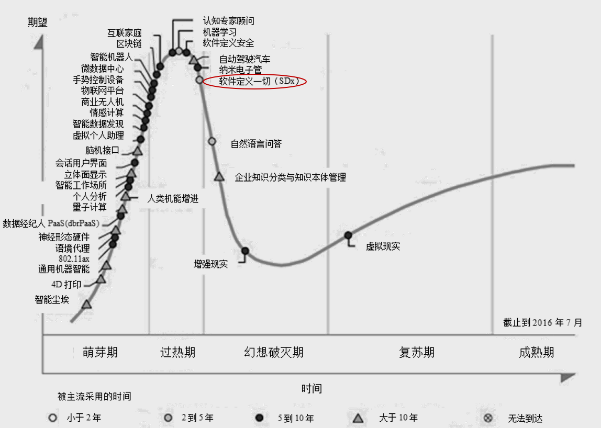

# WHY?
1. 全球IP流量预测大规模增长
2. 性能以及协同是未来关键
3. 5G和云时代对网络的要求（高可靠低时延）

# 技术演进
## 传统MPLS网络存在的问题
### MPLS LDP
1. LDP本身并无算路能力，需依赖IGP进行路径计算控制面需要IGP及LDP，
2. 设备之间需要发送大量的消息来维持邻居关系及路径状态，浪费了链路带宽及设备资源
3. 若LDP与IGP未同步，则可能出现数据转发问题

