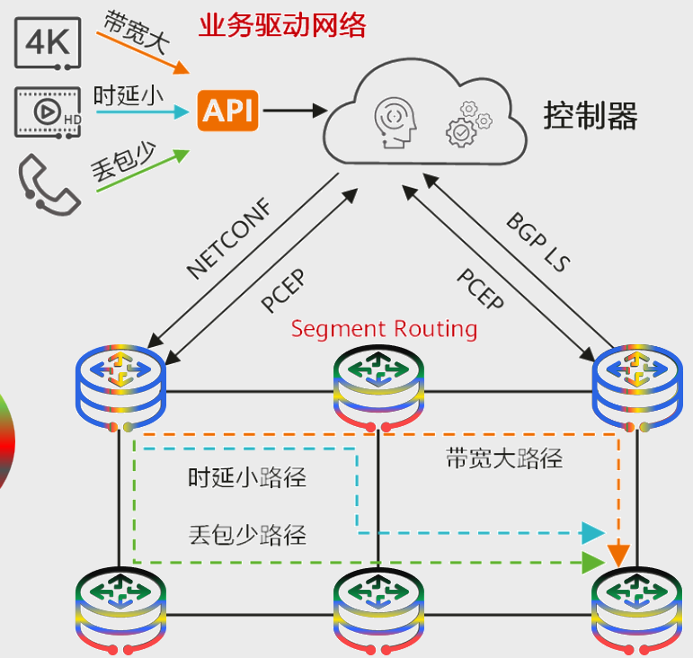
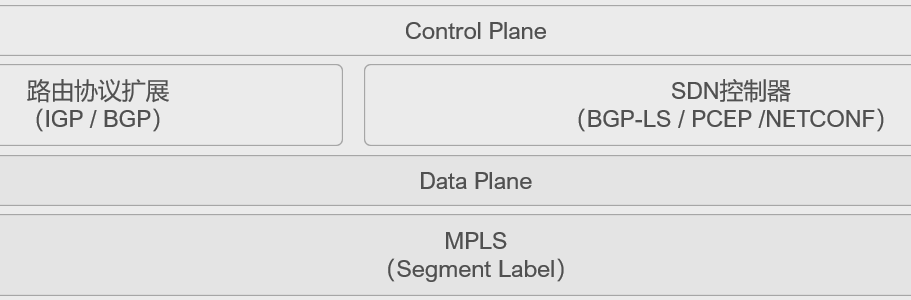
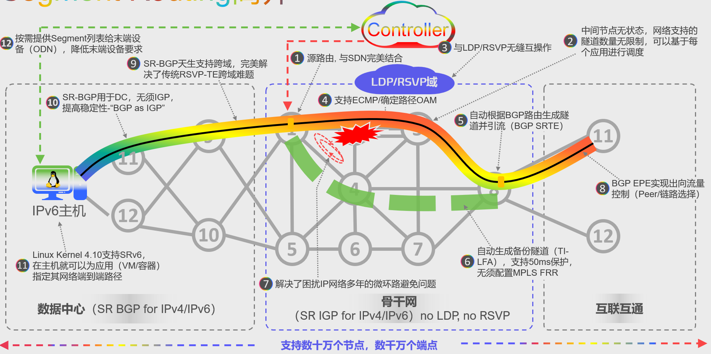

# WHY?
1. 全球IP流量预测大规模增长
2. 性能以及协同是未来关键
3. 5G和云时代对网络的要求（高可靠低时延）

# 技术演进
## 传统MPLS网络存在的问题
### MPLS LDP
1. LDP本身并无算路能力，需依赖IGP进行路径计算控制面需要IGP及LDP，
2. 设备之间需要发送大量的消息来维持邻居关系及路径状态，浪费了链路带宽及设备资源
3. 若LDP与IGP未同步，则可能出现数据转发问题

### MPLS RSVP-TE
1. RSVP-TE的配置复杂，不支持负载分担
2. 设备间交互大量信令报文维持邻居关系及路径状态，浪费链路带宽及设备资源
3. RSVP-TE本质上是分布式架构，每台设备只知道自己的状态，设备之间需要交互信令报文

# 业务驱动网络:由业务来定义网络的架构
5G和云业务的发展改变了网络连接的属性和范围。它们对连接提出了更多的要求，例如更强的SLA保证、确定性时延或者要求报文携带更多的信息。如果仍旧按照网络适配业务的思路，则不仅无法匹配业务的快速发展，而且会使网络越来越复杂，变的难以维护。

解决思路就是业务驱动网络，由业务来定义网络的架构--由应用提出需求(时延、带宽、丢包率等)，控制器收集网络拓扑、带宽利用率、时延等信息，根据业务需求计算显式路径

# Segment Routing的解决思路
## 简化协议，基于现有协议扩展:
- 扩展后的IGP/BGP具有标签分发能力，因此网络中无需LDP，实现协议简化。且设备仅需进行软件升级，无需进行硬件更换，保护现网投资
- 引入源路由机制：通过在头端节点实例化转发策略为标签列表，控制业务流量的转发路径
## 由业务来定义网络:
- 由应用提出需求(时延、带宽、丢包率等)，控制器收集网络拓扑、带宽利用率、时延等信息，根据业务需求计算显式路径，最后下发SR路径来承载业务

# Segment Routing简介
## 什么是Segment Routing
- SR (Segment Routing/分段路由，RFC8402“Segment Routing Architecture”)是基于源路由理念而设计的在网络上转发数据包的一种架构。Segment Routing MPLS是指基于MPLS转发平面的Segment Routing
- SR将网络路径分成一个个段(Segment)，并且为这些段和网络中的转发节点分配段标识ID。通过对段和网络节点进行有序排列(Segment List)，就可以得到一条转发路径
- SR将代表转发路径的段序列编码在数据包头部，随数据包传输。接收端收到数据包后，对段序列进行解析，如果段序列的顶部段标识是本节点时，则弹出该标识，然后进行下一步处理;如果不是本节点，则使用ECMP(Equal Cost Multiple Path，等价负载分担)方式将数据包转发到下一节点
## Segment Routing的特点
- 通过对现有协议(例如IGP)进行扩展，能使现有网络更好的平滑演进
- 同时支持控制器的集中控制模式和转发器的分布控制模式，提供集中控制和分布控制之间的平衡
- 采用源路由技术，提供网络和上层应用快速交互的能力

**SR-MPLS的工作就是将报文转发路径切割成不同的分段并为其分配SID，然后通过在路径的起始点往报文中插入分段信息的方式来指导报文正确的转发到目的地**

# SR-MPLS技术价值
- SR-MPLS伴随着SDN思潮应运而生，SR-MPLS技术能够使网络更加简化，并具有良好的可扩展能力，主要体现在以下方面:
	- 1.更简单的控制平面:无需部署LDP/RSVP-TE协议，只需要设备通过IGP/BGP协议扩展来实现标签分发或同步，或者由控制器统一负责SR标签的分配，并下发和同步给设备
	- 2.易扩展的转发平面:SR-MPLS复用了已有的MPLS转发平面，网络设备不做改动或者进行简单升级就可以支持SR的转发，在SR-MPLS中，Segment可以映射为MPLS标签，路径就是标签栈

# Segment Routing的优势

| 优势                          | 解释                                                                                                                                                                       |
| --------------------------- | ------------------------------------------------------------------------------------------------------------------------------------------------------------------------ |
| 1.简化MPLS网络的控制平面             | - SR使用控制器或者IGP集中算路和分发标签，不再需要RSVP-TE，LDP等隧道协议 - SR可以直接应用于MPLS架构，转发平面没有变化                                                                                               |
| 2.高效TI-LFA FRR保护实现路径故障的快速恢复 | - 在SR技术的基础上结合RLFA (Remote Loop-free Alternate) FRR算法,形成高效的TI-LFA (Topology-IndependentLoop-free Alternate)FRR算法 - TI-LFAFRR支持任意拓扑的节点和链路保护，能够弥补传统隧道保护技术的不足             |
| 3.SR更具有网络容量扩展能力             | - 传统MPLS TE是一种面向连接的技术，为了维护连接状态，节点间需要发送和处理大量Keepalive报文，设备控制层面压力大 - SR仅在头节点对报文进行标签操作即可任意控制业务路径，中间节点不需要维护路径信息，设备控制层面压力小。此外，SR技术的标签数量是:全网节点数+本地邻接数，只和网络规模相关，与隧道数量和业务规模无关 |
| 4.更好的向SDN网络平滑演进             | - SR技术基于源路由理念而设计，通过源节点即可控制数据包在网络中的转发路径配合集中算路模块，即可灵活简便地实现路径控制与调整 - SR同时支持传统网络和SDN网络，兼容现有设备，保障现有网络平滑演进到SDN网络                                                            |

# SR MPLS 与 MPLS 
SR-MPLS相比于MPLS，一方面保留了MPLS转发平面的优势，使得SR-MPLS可以直接应用在现有MPLS架构上，另一方面也对
传统MPLS技术做了革命性的颠覆和创新

|         | Segment Routing MPLS          | MPLS                                                          | SR-MPLS 优势                         |
| ------- | ----------------------------- | ------------------------------------------------------------- | ---------------------------------- |
| 控制协议    | IGP/BGP                       | LDP/RSVP-TE/IGP/BGP                                           | 不使用LDP和RSVP-TE，网络更简单，能使现有网络更好的平滑演进 |
| 路径计算和调整 | 仅在源节点计算和调整                    | 网络中各个节点逐个计算和调整                                                | 采用源路由技术，中间节点无需维护路径信息，设备控制平面压力小     |
| 标签分发    | 为邻接链路和SR节点分配标签，标签占用少，设备资源占用率低 | 标签数量随着隧道数量增加而增加，设备资源占用率高                                      | 标签占用少，设备资源占用率低                     |
| 网络扩展能力  | 无状态协议，有利用网络扩展                 | 传统MPLSTE是一种面向连接的技术，为了维护连接状态，节点间需要发送和处理大量Keepalive报文，设备控制层面压力大 | 无状态协议，有利用网络扩展                      |
| 网络架构    | 同时支持传统网络和SDN网络，兼容现有设备:        | 支持传统网络，不符合SDN思想                                               | 符合SDN思想，提供集中式控制和分布式控制之间的平衡         |

