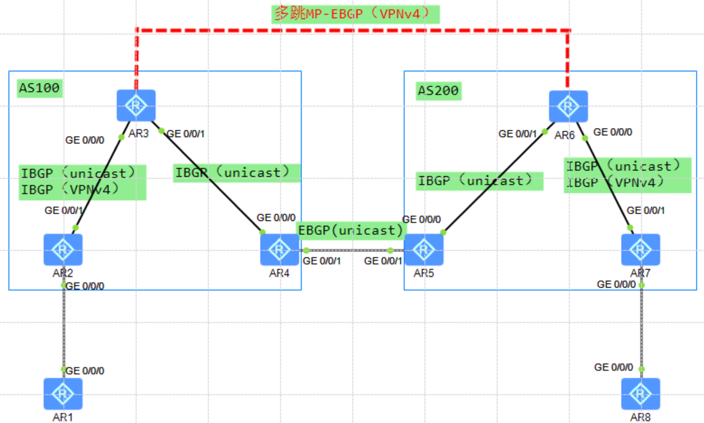

# RR之间建立多跳MP-EBGP邻居

## 配置详解：
1. 底层使用IGP互联互通（OSPF，ISIS）
2. 配置LDP协议，PE，P，ASBR之间都需要配置
3. PE与CE之间通过IGP或者EBGP传递路由
4. 同一个AS内部使能标签路由能力
	1. RR分别与PE，ASBR使能标签路由能力在IPv4-Unicast地址族下
	2. PE，ASBR与RR建立反射器关系（IPv4地址族下）
5. ASBR1与ASBR2之间建立EBGP邻居关系
	1. network通告本端RR的Loopback地址
	2. network通告本端PE的loopback地址
	3. 对来自本端PE的路由分配标签，使能标签路由能力，传递给对端ASBR
	4. 对来自对端ASBR的路由重新分配标签，使能标签路由能力，传递给本端PE
	5. 互联接口使能mpls
6. RR1与RR2建立多跳MP-EBGP邻居关系（VPNv4）
	1. RR与PE建立VPNv4邻居关系（反射器），并且使能next-hop-invariable
	2. RR1与RR2也使能next-hop-invariable
	3. RR1与RR2之间ebgp-max-hop

## 拓扑


注意：配置完底层IBGP和LDP分配公网标签后
1. PE，RR，ASBR，之间先建立IBGP（Unicast）关系，使能标签路由的能力；然后ASBR用network通告PE和RR的loopback地址；并且配置标签策略。
2. RR之间建立多跳MP-EBGP（VPNv4）邻居关系，RR与PE之间建立MP-IBGP（VPNv4）反射邻居，并且RR1针对PE1和RR都需要使能next-hop-invariable；

解释：注意1，2
为什么要在ASBR要通告PE和RR的loopback地址呢？
1. 通告RR的loopback地址是为了让对端RR学习到，从而能够建立多跳MP-EBGP（VPNv4）邻居。
2. 通告PE的loopback地址原因是：
	1. 如果不通告：
		1. 首先明确一点，从IBGP学习来的路由，传递给EBGP邻居时默认下一跳是会改变为自己的loopback地址。
		2. 如果不通告，两端也能ping通，但是RR承担了ASBR的功能（跨域 VPN 标签中转节点），会存在L3VPN LSP。增加了RR的负担。
	我们想要的是，RR只传递路由，不做任何承载
	 2. 通告PE的loopback地址
		 1. 首先要解决下一跳自动改变的情况，通告next-hop-invariable来保证下一跳不变
		 2. 下一跳不变了，那么对端PE收到的本端的私网路由，下一跳为PE1，没有通告PE1的地址的话，这是不可达的，会被扔掉，所以需要在ASBR1通告PE1的loopback地址。

没有通告PE的loopback地址，并且下一跳改变。
```
[RR1-AR3-bgp]dis mpls lsp 
------------------------------------------------------------------------------
				 LSP Information: BGP LSP 
------------------------------------------------------------------------------- 
FEC                 In/Out Label  In/Out IF                      Vrf Name 
6.6.6.6/32          NULL/1028     -/- 
-------------------------------------------------------------------------------
				 LSP Information: L3VPN LSP 
------------------------------------------------------------------------------- 
FEC                In/Out Label  In/Out IF                       Vrf Name 
100.1.1.1/32       1028/1026     -/-                             ASBR LSP 
100.2.2.2/32       1029/1028     -/-                             ASBR LSP 
-------------------------------------------------------------------------------
				 LSP Information: LDP LSP 
------------------------------------------------------------------------------- 
FEC                In/Out Label  In/Out IF                       Vrf Name 
3.3.3.3/32         3/NULL        -/- 
2.2.2.2/32         NULL/3        -/GE0/0/0 
2.2.2.2/32         1024/3        -/GE0/0/0 
4.4.4.4/32         NULL/3        -/GE0/0/1 
4.4.4.4/32         1025/3        -/GE0/0/1
```

通告PE的loopback地址，并且保持下一跳不变。
```
<RR1-AR3>dis mpls lsp 
-------------------------------------------------------------------------------
                 LSP Information: BGP  LSP
-------------------------------------------------------------------------------
FEC                In/Out Label  In/Out IF                      Vrf Name       
7.7.7.7/32         NULL/1027     -/-                                           
6.6.6.6/32         NULL/1026     -/-                                           
-------------------------------------------------------------------------------
                 LSP Information: LDP LSP
-------------------------------------------------------------------------------
FEC                In/Out Label  In/Out IF                      Vrf Name       
3.3.3.3/32         3/NULL        -/-                                           
2.2.2.2/32         NULL/3        -/GE0/0/0                                     
2.2.2.2/32         1024/3        -/GE0/0/0                                     
4.4.4.4/32         NULL/3        -/GE0/0/1                                     
4.4.4.4/32         1025/3        -/GE0/0/1 
```
## 配置：
### PE1_AR2
```
bgp 100
 router-id 2.2.2.2
 peer 3.3.3.3 as-number 100 
 peer 3.3.3.3 connect-interface LoopBack0
 #
 ipv4-family unicast
  undo synchronization
  peer 3.3.3.3 enable
  peer 3.3.3.3 label-route-capability
 # 
 ipv4-family vpnv4
  policy vpn-target
  peer 3.3.3.3 enable
 #
 ipv4-family vpn-instance a 
  network 100.1.1.1 255.255.255.255 
```
### RR1_AR3
```
bgp 100
 router-id 3.3.3.3
 peer 2.2.2.2 as-number 100 
 peer 2.2.2.2 connect-interface LoopBack0
 peer 4.4.4.4 as-number 100 
 peer 4.4.4.4 connect-interface LoopBack0
	 peer 6.6.6.6 as-number 200 
 peer 6.6.6.6 ebgp-max-hop 255 
 peer 6.6.6.6 connect-interface LoopBack0
 #
 ipv4-family unicast
  undo synchronization
  peer 2.2.2.2 enable
  peer 2.2.2.2 reflect-client
  peer 2.2.2.2 label-route-capability
  peer 4.4.4.4 enable
  peer 4.4.4.4 reflect-client
  peer 4.4.4.4 label-route-capability
  undo peer 6.6.6.6 enable
 # 
 ipv4-family vpnv4
  undo policy vpn-target
  peer 2.2.2.2 enable                     
  peer 2.2.2.2 reflect-client
  peer 2.2.2.2 next-hop-invariable 
  peer 6.6.6.6 enable
  peer 6.6.6.6 next-hop-invariable
```
### ASBR1_AR4
```
bgp 100
 router-id 4.4.4.4
 peer 3.3.3.3 as-number 100 
 peer 3.3.3.3 connect-interface LoopBack0
 peer 10.1.45.5 as-number 200 
 #
 ipv4-family unicast
  undo synchronization
  network 2.2.2.2 255.255.255.255 
  network 3.3.3.3 255.255.255.255 
  peer 3.3.3.3 enable
  peer 3.3.3.3 route-policy 2 export
  peer 3.3.3.3 label-route-capability
  peer 10.1.45.5 enable
  peer 10.1.45.5 route-policy 1 export
  peer 10.1.45.5 label-route-capability
```
### ASBR2_AR5
```
bgp 200
 router-id 5.5.5.5
 peer 6.6.6.6 as-number 200 
 peer 6.6.6.6 connect-interface LoopBack0
 peer 10.1.45.4 as-number 100 
 #
 ipv4-family unicast
  undo synchronization
  network 6.6.6.6 255.255.255.255 
  network 7.7.7.7 255.255.255.255 
  peer 6.6.6.6 enable
  peer 6.6.6.6 route-policy 2 export
  peer 6.6.6.6 label-route-capability
  peer 10.1.45.4 enable
  peer 10.1.45.4 route-policy 1 export
  peer 10.1.45.4 label-route-capability
```


## 路径测试
```
<CE1>tracert -v -a 100.1.1.1 100.2.2.2
 traceroute to  100.2.2.2(100.2.2.2), max hops: 30 ,packet length: 40,press CTRL_C to break 
 1 10.1.12.2 40 ms  10 ms  10 ms 
 2 10.1.23.3[MPLS Label=1025/1027/1024 Exp=0/0/0 S=0/0/1 TTL=1/1/1] 60 ms  60 ms  40 ms 
 3 10.1.34.4[MPLS Label=1027/1024 Exp=0/0 S=0/1 TTL=1/2] 50 ms  50 ms  60 ms 
 4 10.1.45.5[MPLS Label=1027/1024 Exp=0/0 S=0/1 TTL=1/3] 50 ms  50 ms  50 ms 
 5 10.1.56.6[MPLS Label=1025/1024 Exp=0/0 S=0/1 TTL=1/4] 60 ms  70 ms  50 ms 
 6 10.1.78.7 50 ms  50 ms  60 ms 
 7 10.1.78.8 60 ms  60 ms  60 ms
```


## LSP详解
PE的mpls lsp存在私网路由100.1.1.1/32
```
<PE1-AR2>dis mpls lsp 
-------------------------------------------------------------------------------
                 LSP Information: BGP  LSP
-------------------------------------------------------------------------------
FEC                In/Out Label  In/Out IF                      Vrf Name       
100.1.1.1/32       1026/NULL     -/-                            a              
6.6.6.6/32         NULL/1026     -/-                                           
7.7.7.7/32         NULL/1027     -/-                                           
-------------------------------------------------------------------------------
                 LSP Information: LDP LSP
-------------------------------------------------------------------------------
FEC                In/Out Label  In/Out IF                      Vrf Name       
3.3.3.3/32         NULL/3        -/GE0/0/1                                     
3.3.3.3/32         1024/3        -/GE0/0/1                                     
2.2.2.2/32         3/NULL        -/-                                           
4.4.4.4/32         NULL/1025     -/GE0/0/1                                     
4.4.4.4/32         1025/1025     -/GE0/0/1 
```
RR的mpls lsp不存在私网路由，只存在跨AS的公网标签
```
<RR1-AR3>dis mpls lsp 
-------------------------------------------------------------------------------
                 LSP Information: BGP  LSP
-------------------------------------------------------------------------------
FEC                In/Out Label  In/Out IF                      Vrf Name       
7.7.7.7/32         NULL/1027     -/-                                           
6.6.6.6/32         NULL/1026     -/-                                           
-------------------------------------------------------------------------------
                 LSP Information: LDP LSP
-------------------------------------------------------------------------------
FEC                In/Out Label  In/Out IF                      Vrf Name       
3.3.3.3/32         3/NULL        -/-                                           
2.2.2.2/32         NULL/3        -/GE0/0/0                                     
2.2.2.2/32         1024/3        -/GE0/0/0                                     
4.4.4.4/32         NULL/3        -/GE0/0/1                                     
4.4.4.4/32         1025/3        -/GE0/0/1 
```