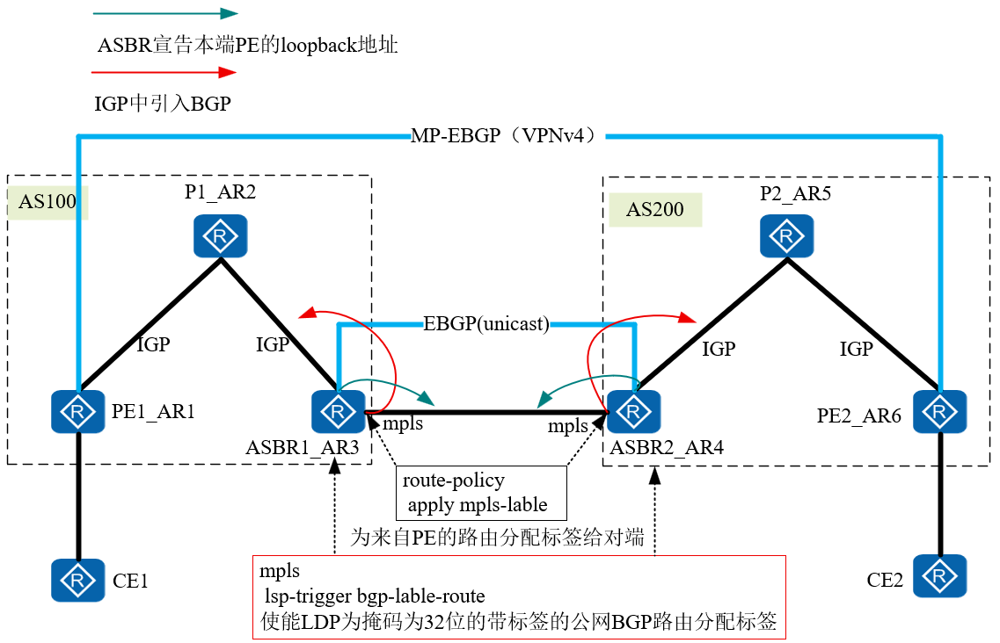

## 配置详解

1. 底层使用IGP互联互通（OSPF，ISIS）
2. 配置LDP协议，PE，P，ASBR之间都需要配置
3. PE与CE之间通过IGP或者EBGP传递路由
4. ASBR之间建立EBGP（unicast）邻居
	1. 通告本端PE的loopback地址
	2. 在IGP（OSPF，ISIS）进程中引入BGP
	3. 在MPLS视图下使能： lsp-trigger bgp-label-route  
	4. 为ASBR传递给对端ASBR的BGP路由分配标签，并使能标签路由能力。
5. PE通告ASBR引入到IGP的路由学习到对端PE的loopback地址，建立多跳MP-EBGP（VPNv4）邻居

## 拓扑


## 详细配置
### PE1
```
bgp 100
 router-id 1.1.1.1
 peer 6.6.6.6 as-number 200 
 peer 6.6.6.6 ebgp-max-hop 255 
 peer 6.6.6.6 connect-interface LoopBack0
 #
 ipv4-family unicast
  undo synchronization
  undo peer 6.6.6.6 enable
 # 
 ipv4-family vpnv4
  policy vpn-target
  peer 6.6.6.6 enable
 #
 ipv4-family vpn-instance a 
  network 7.7.7.7 255.255.255.255 
```
### ASBR1
```
bgp 100
 router-id 3.3.3.3
 peer 10.1.34.4 as-number 200 
 #
 ipv4-family unicast
  undo synchronization
  network 1.1.1.1 255.255.255.255 
  peer 10.1.34.4 enable
  peer 10.1.34.4 route-policy asbr export
  peer 10.1.34.4 label-route-capability
#  
mpls  
 lsp-trigger bgp-label-route  
#  
Route-policy 2 permit node 10   
  apply mpls-label 
# 
interface GigabitEthernet0/0/1
 ip address 10.1.34.3 255.255.255.0 
 mpls
```
### PE2  
```
bgp 200
 peer 1.1.1.1 as-number 100 
 peer 1.1.1.1 ebgp-max-hop 255 
 peer 1.1.1.1 connect-interface LoopBack0
 #
 ipv4-family unicast
  undo synchronization
  undo peer 1.1.1.1 enable
 # 
 ipv4-family vpnv4
  policy vpn-target
  peer 1.1.1.1 enable
 #
 ipv4-family vpn-instance a 
  network 8.8.8.8 255.255.255.255
```
### ASBR2
```
bgp 200
 peer 10.1.34.3 as-number 100 
 #
 ipv4-family unicast
  undo synchronization
  network 6.6.6.6 255.255.255.255 
  peer 10.1.34.3 enable
  peer 10.1.34.3 route-policy asbr export
  peer 10.1.34.3 label-route-capability
#  
ospf 1 r 1.5.5.5  
   import-route bgp  
#  
interface GigabitEthernet0/0/1  
 ip address 10.0.45.5 255.255.255.0   
 mpls  
#  
mpls  
 lsp-trigger bgp-label-route  
#  
Route-policy 2 permit node 10   
  apply mpls-label 
```

### 与Option-C1方案的区别：
1.不再需要PE与ASBR之间建立IBGP邻居
2.不再需要中间件标签，通过 lsp-trigger bgp-label-route ，代替该功能
3.PE1之间路由的学习不再需要通路的BGP学习到，通过在ASBR中的IGP中引入BGP实习

### 控制平面：
1.PE之间，之间建立LDP LSP，而不是BGP LSP
2.P1到ASBR之间的标签不会只剩下私网标签，而是存在公网标签，但是公网标签与私网标签一样，
因为，PE1与PE2之间是通过LDP LSP分发的标签，所以PE1到ASBR1不算做倒数第二天，
而是，到PE2才算做是倒数第二跳，才会把公网标签pop出。
  

### 数据平面：
1.PE1查表：
[PE1]display bgp vpnv4 all routing-table 192.168.2.0，发现去往192.168.2.0/24需要进行私网标签1027封装，下一跳是7.7.7.7需要递归到IGP
  
  

2.去往7.7.7.7的TunnelID非0，需要mpls‘封装 1025标签
[PE1]display fib 7.7.7.7

  
  
  

3.通过中间结点：公网标签替换为1027，与私网标签一致
[P1]dis mpls lsp


公网标签
  

4.数据到达ASBR1后，因为存在route-policy，会更新mpls标签，该标签会一直沿用到倒数第二跳弹出
  

6.数据包到达PE2，后公网标签弹出，PE2更具私网标签，将数包送到对应的接口


## 路径跟踪

```
<CE1>tracert -v -a 7.7.7.7 8.8.8.8
 traceroute to  8.8.8.8(8.8.8.8), max hops: 30 ,packet length: 40,press CTRL_C to break 
 1 10.1.17.1 30 ms  20 ms  20 ms 
 2 10.1.12.2[MPLS Label=1024/1028 Exp=0/0 S=0/1 TTL=1/1] 50 ms  40 ms  40 ms 
 3 10.1.23.3[MPLS Label=1025/1028 Exp=0/0 S=0/1 TTL=1/2] 40 ms  50 ms  50 ms 
 4 10.1.34.4[MPLS Label=1025/1028 Exp=0/0 S=0/1 TTL=1/3] 50 ms  40 ms  40 ms 
 5 10.1.45.5[MPLS Label=1025/1028 Exp=0/0 S=0/1 TTL=1/4] 40 ms  30 ms  60 ms 
 6 10.1.68.6 40 ms  50 ms  50 ms 
 7 10.1.68.8 70 ms  50 ms  50 ms
```

## 表项查看

### PE1
1. 存在BGP LSP，为本端私网路由分配标签
2. LDP LSP 为公网路由分配标签
```
<PE1>dis mpls lsp 
-------------------------------------------------------------------------------
                 LSP Information: BGP  LSP
-------------------------------------------------------------------------------
FEC                In/Out Label  In/Out IF                      Vrf Name       
7.7.7.7/32         1031/NULL     -/-                            a              
-------------------------------------------------------------------------------
                 LSP Information: LDP LSP
-------------------------------------------------------------------------------
FEC                In/Out Label  In/Out IF                      Vrf Name       
2.2.2.2/32         NULL/3        -/GE0/0/1                                     
2.2.2.2/32         1024/3        -/GE0/0/1                                     
3.3.3.3/32         NULL/1025     -/GE0/0/1                                     
3.3.3.3/32         1025/1025     -/GE0/0/1                                     
6.6.6.6/32         NULL/1024     -/GE0/0/1                                     
6.6.6.6/32         1026/1024     -/GE0/0/1                                     
1.1.1.1/32         3/NULL        -/-
```

### P1，在无RR的场景
1. 只存在LDP公网标签
```
[P1]dis mpls lsp
-------------------------------------------------------------------------------
                 LSP Information: LDP LSP
-------------------------------------------------------------------------------
FEC                In/Out Label  In/Out IF                      Vrf Name       
2.2.2.2/32         3/NULL        -/-                                           
6.6.6.6/32         NULL/1025     -/GE0/0/1                                     
6.6.6.6/32         1024/1025     -/GE0/0/1                                     
3.3.3.3/32         NULL/3        -/GE0/0/1                                     
3.3.3.3/32         1025/3        -/GE0/0/1                                     
1.1.1.1/32         NULL/3        -/GE0/0/0                                     
1.1.1.1/32         1026/3        -/GE0/0/0
```
### ASBR
 1. 存在BGP LSP标签，该标签为跨域标签去往对端PE设备
 2. 存在公网标签
```
<ASBR1>dis mpls lsp 
-------------------------------------------------------------------------------
                 LSP Information: BGP  LSP
-------------------------------------------------------------------------------
FEC                In/Out Label  In/Out IF                      Vrf Name       
6.6.6.6/32         NULL/1025     -/-                                           
1.1.1.1/32         1026/NULL     -/-                                           
-------------------------------------------------------------------------------
                 LSP Information: LDP LSP
-------------------------------------------------------------------------------
FEC                In/Out Label  In/Out IF                      Vrf Name       
2.2.2.2/32         NULL/3        -/GE0/0/0                                     
2.2.2.2/32         1024/3        -/GE0/0/0                                     
6.6.6.6/32         1025/1025     -/-                                           
3.3.3.3/32         3/NULL        -/-                                           
1.1.1.1/32         NULL/1026     -/GE0/0/0                                     
1.1.1.1/32         1027/1026     -/GE0/0/0 
```