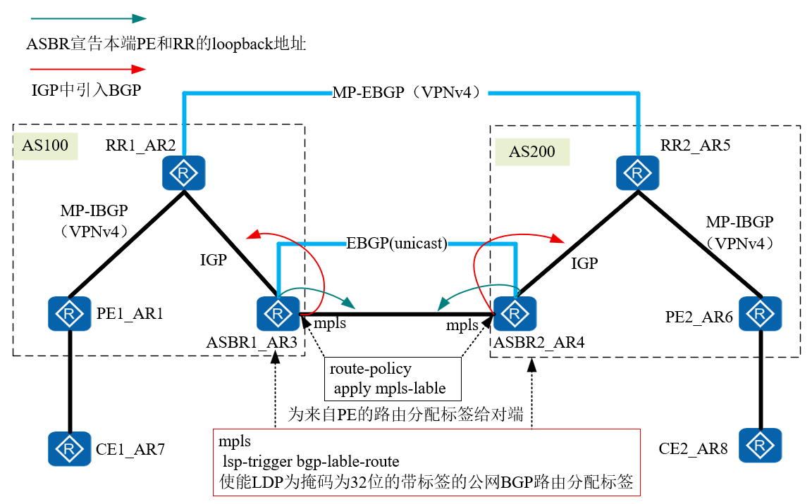

# 配置详解

1. 底层使用IGP互联互通（OSPF，ISIS）
2. 配置LDP协议，PE，P，ASBR之间都需要配置
3. PE与CE之间通过IGP或者EBGP传递路由
4. ASBR之间建立EBGP（unicast）邻居
	1. 通告本端PE和RR的loopback地址
	2. 在IGP（OSPF，ISIS）进程中引入BGP
	3. 在MPLS视图下使能： lsp-trigger bgp-label-route  
	4. 为ASBR传递给对端ASBR的BGP路由分配标签，并使能标签路由能力。
5. RR通过ASBR引入到IGP的路由学习到对端RR的loopback地址，建立多跳MP-EBGP（VPNv4）邻居
6. PE与RR建立MP-IBGP邻居（VPNv4）RR反射VPNv4路由给PE。
7. RR与本端PE和对端RR使能next-hop-invariable，保证下一跳不变

## 注意
1. 对端PE和RR的loopback地址已经通过在ASBR的IGP进程中引入BGP路由学习到
2. 所以PE和RR之间不用建立IBGP（uncast）邻居关系
## 拓扑



## 配置
### PE1
```
bgp 100
 router-id 1.1.1.1
 peer 2.2.2.2 as-number 100 
 peer 2.2.2.2 connect-interface LoopBack0
 #
 ipv4-family unicast
  undo synchronization
  peer 2.2.2.2 enable
 # 
 ipv4-family vpnv4
  policy vpn-target
  peer 2.2.2.2 enable
 #
 ipv4-family vpn-instance a 
  network 7.7.7.7 255.255.255.255
```

### RR1
```
bgp 100
 router-id 2.2.2.2
 peer 1.1.1.1 as-number 100 
 peer 1.1.1.1 connect-interface LoopBack0
 peer 5.5.5.5 as-number 200 
 peer 5.5.5.5 ebgp-max-hop 255 
 peer 5.5.5.5 connect-interface LoopBack0
 #
 ipv4-family unicast
  undo synchronization
  peer 1.1.1.1 enable
  peer 5.5.5.5 enable
 # 
 ipv4-family vpnv4
  undo policy vpn-target
  peer 1.1.1.1 enable
  peer 1.1.1.1 reflect-client
  peer 1.1.1.1 next-hop-invariable 
  peer 5.5.5.5 enable
  peer 5.5.5.5 next-hop-invariable
```

### ASBR1
```
bgp 100
 router-id 3.3.3.3
 peer 10.1.34.4 as-number 200 
 #
 ipv4-family unicast
  undo synchronization
  network 1.1.1.1 255.255.255.255 
  network 2.2.2.2 255.255.255.255 
  peer 10.1.34.4 enable
  peer 10.1.34.4 route-policy asbr export
  peer 10.1.34.4 label-route-capability
# 
mpls
 lsp-trigger bgp-label-route
# 
route-policy asbr permit node 10 
 apply mpls-label
# 
interface GigabitEthernet0/0/1
 ip address 10.1.34.3 255.255.255.0 
 mpls
```

## 输出
### tracert 路径
```
<CE1>tracert -v -a 7.7.7.7 8.8.8.8
 traceroute to  8.8.8.8(8.8.8.8), max hops: 30 ,packet length: 40,press CTRL_C to break 
 1 10.1.17.1 50 ms  10 ms  10 ms 
 2 10.1.12.2[MPLS Label=1024/1028 Exp=0/0 S=0/1 TTL=1/1] 80 ms  40 ms  40 ms 
 3 10.1.23.3[MPLS Label=1026/1028 Exp=0/0 S=0/1 TTL=1/2] 50 ms  50 ms  60 ms 
 4 10.1.34.4[MPLS Label=1025/1028 Exp=0/0 S=0/1 TTL=1/3] 50 ms  40 ms  50 ms 
 5 10.1.45.5[MPLS Label=1024/1028 Exp=0/0 S=0/1 TTL=1/4] 50 ms  40 ms  60 ms 
 6 10.1.68.6 60 ms  40 ms  40 ms 
 7 10.1.68.8 70 ms  50 ms  60 ms
```

### PE1
```
<PE1>dis mpls lsp 
-------------------------------------------------------------------------------
                 LSP Information: BGP  LSP
-------------------------------------------------------------------------------
FEC                In/Out Label  In/Out IF                      Vrf Name       
7.7.7.7/32         1030/NULL     -/-                            a              
-------------------------------------------------------------------------------
                 LSP Information: LDP LSP
-------------------------------------------------------------------------------
FEC                In/Out Label  In/Out IF                      Vrf Name       
2.2.2.2/32         NULL/3        -/GE0/0/1                                     
2.2.2.2/32         1024/3        -/GE0/0/1                                     
3.3.3.3/32         NULL/1026     -/GE0/0/1                                     
3.3.3.3/32         1025/1026     -/GE0/0/1                                     
5.5.5.5/32         NULL/1025     -/GE0/0/1                                     
5.5.5.5/32         1026/1025     -/GE0/0/1                                     
6.6.6.6/32         NULL/1024     -/GE0/0/1                                     
6.6.6.6/32         1027/1024     -/GE0/0/1                                     
1.1.1.1/32         3/NULL        -/-   
```

### RR1
```
<RR1>dis mpls lsp 
-------------------------------------------------------------------------------
                 LSP Information: LDP LSP
-------------------------------------------------------------------------------
FEC                In/Out Label  In/Out IF                      Vrf Name       
2.2.2.2/32         3/NULL        -/-                                           
6.6.6.6/32         NULL/1026     -/GE0/0/1                                     
6.6.6.6/32         1024/1026     -/GE0/0/1                                     
5.5.5.5/32         NULL/1027     -/GE0/0/1                                     
5.5.5.5/32         1025/1027     -/GE0/0/1                                     
3.3.3.3/32         NULL/3        -/GE0/0/1                                     
3.3.3.3/32         1026/3        -/GE0/0/1                                     
1.1.1.1/32         NULL/3        -/GE0/0/0                                     
1.1.1.1/32         1027/3        -/GE0/0/0
```

### ASBR1
```
<ASBR1>dis mpls lsp 
-------------------------------------------------------------------------------
                 LSP Information: BGP  LSP
-------------------------------------------------------------------------------
FEC                In/Out Label  In/Out IF                      Vrf Name       
5.5.5.5/32         NULL/1024     -/-                                           
6.6.6.6/32         NULL/1025     -/-                                           
2.2.2.2/32         1024/NULL     -/-                                           
1.1.1.1/32         1028/NULL     -/-                                           
-------------------------------------------------------------------------------
                 LSP Information: LDP LSP
-------------------------------------------------------------------------------
FEC                In/Out Label  In/Out IF                      Vrf Name       
2.2.2.2/32         NULL/3        -/GE0/0/0                                     
2.2.2.2/32         1025/3        -/GE0/0/0                                     
6.6.6.6/32         1026/1025     -/-                                           
5.5.5.5/32         1027/1024     -/-                                           
3.3.3.3/32         3/NULL        -/-                                           
1.1.1.1/32         NULL/1027     -/GE0/0/0                                     
1.1.1.1/32         1029/1027     -/GE0/0/0                                     
```