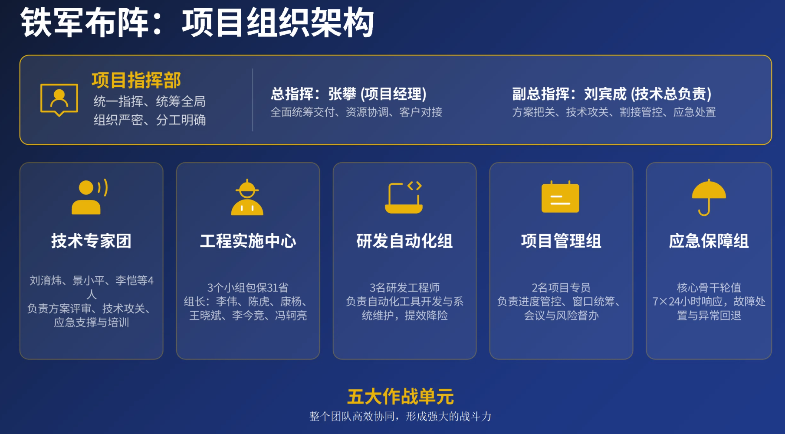
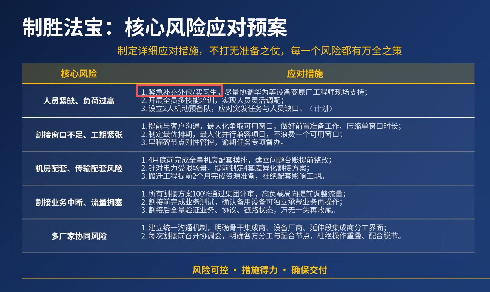

# 2026年中国移动骨干网集成项目工程保交付动员大会

中电，中银

中国移动，中国联通

老中银的人

srv6,RoCE, 智算，无损网络；
今年 7-8千万交付工作
技术力量，

案例：（安全警示）
1.24年，高考，广东电信，133， 改了出口路由器的带宽（安全事件）
新疆-骨干路由-吉林，（上升政治事件）

23-24
CMD  CMC 
软件降本，网络地位提升

通信，算力

# 要求：
1.基业长青
2.够通，协作 BU，加强，使命感，荣誉感，加强协作
3.AI（降低出粗的概论，） boss, oss, 集成
亚信：IP VPN网管，业务编排，

大的业务：
1.cost 值配错，2011年（张p总） 813北京故障 CR割接

AI ---->通信，算力，智能（自治网络）
做出点什么来

做事：有板有眼，稳扎稳打，使命感，仪式感
如何做出来：
1.拉出架势：确保干的活都是精品
2.靠没有故障，
集团，工建部，
3.有规划，把事情坐在前面

# 一件事：
1.别出事，安全生成，全年交付无故障
2.弄点大拿来，做一点东西出来

昆总，赵总

会议概览

本次会议为网络集成团队的年度动员大会，明确了今年艰巨的交付任务、安全目标和团队发展方向。

## 小结

​**​1. 年度交付任务与挑战​**​

- 今年交付任务较去年翻倍，合同金额预计达6500万以上，工作量巨大。
- 项目覆盖全国31个省，涉及设备升级替换近336台，割接窗口稀缺，工期极度紧张。
- 团队面临人员缺口大、割接场景复杂（如原地改造）、安全标准高等多重挑战。

​**​2. 年度目标与管理要求​**​

- ​**​核心目标​**​： 坚决实现“安全生产年”，全年交付无故障，将此作为团队KPI进行激励。
- ​**​管理要求​**​： 强调项目管理的规范化和章法化，推行“三位一体”决策制（总指挥、操作员、复核员），建立明确的操作截止时间，确保每一步操作都经过评审和复核。

​**​3. 安全生产要求​**​

- 会议由项目管理部赵浩进行了专题培训，强调了安全是底线。
- 内容涵盖办公终端、邮箱、访问控制、数据安全、账号协议等多个维度的具体安全规范。
- 强调了“谁主管谁负责”的责任文化，并明确了违规操作的处罚等级。

​**​4. 团队建设与发展方向​**​

- 提出了加强团队内部沟通与协同的建议，鼓励团队成员之间增进了解，增强归属感。
- 提出了团队需要组织团建活动，以促进团队凝聚力。

## 待办

​**​1. 安全生产管理​**​

- 将“全年交付无故障”作为团队KPI纳入激励体系。张凯
- 组织团队进行团建活动。潘总 冰城
- 各项目包负责人需组织团队成员进行安全培训并确保通过考核。各项目包负责人
- 各单位需根据安全自查清单，完成办公场所的安全自查。各项目包负责人

​**​2. 项目管理与执行​**​

- 与各大区负责人互动，提升团队在公司内部的存在感和影响力。张帆 冰城
- 推进AI技术在项目中的应用，探索用AI手段降低出错概率。韩总 齐斌
- 推动项目管理部参与项目排期，建立更科学的项目管理流程。韩总 吴洪亮
